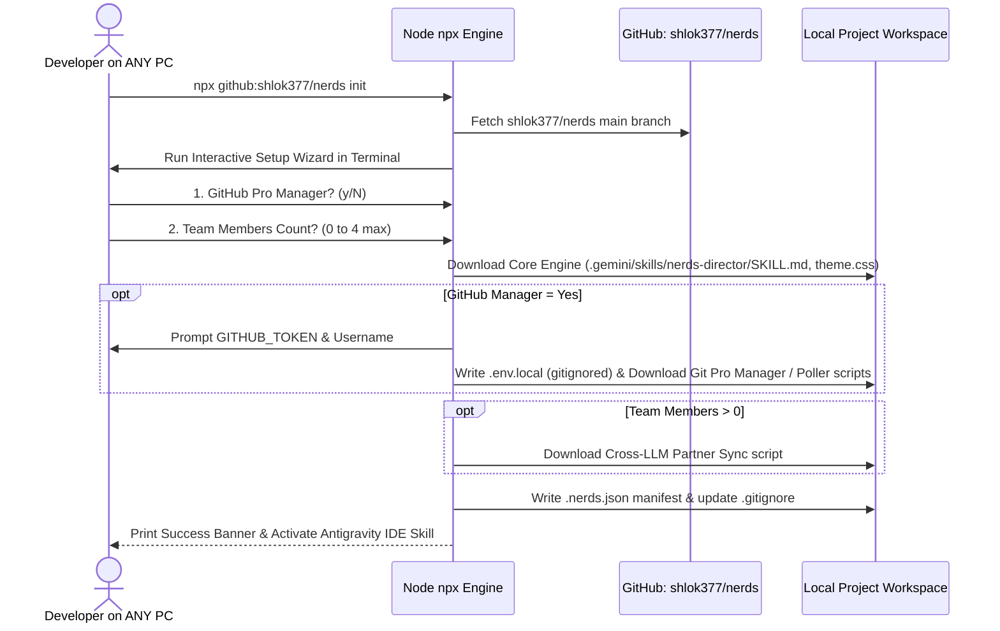

# ⚡ NERDS Autonomous Web Engineering Director

> **NERDS** is a portable, zero-hardcode AI web engineering stack and Antigravity IDE skill that blends multi-agent agency, a native 5-role sprint pipeline, and elite anti-slop design intelligence.

---

## ⚡ Quick Start: Universal 1-Line Installer

To install and set up **NERDS** in any blank or existing web repository, open your terminal in your project directory and run:

```bash
npx github:shlok377/nerds init
```

---

## ⚙️ How the Installer Works

Running `npx github:shlok377/nerds init` launches an interactive setup wizard that configures your project on-demand:



---

## 💎 Core Values (Always Included)

Unlike optional plugins, these core values are non-negotiable defaults included in every project:

### 1. 🎨 NERDS Custom Design Intelligence Engine (Anti-Slop Standard)
* 🚫 **Strict Anti-Slop Bans**: Rejects overused AI slop clichés (low-contrast generic glassmorphism cards, floating blue/purple gradient blurs, boilerplate hero templates).
* ✅ **Enforced Standards**: Custom Obsidian HSL color system (`hsl(222, 24%, 9%)`), fluid responsive typography (`clamp()`), zero Cumulative Layout Shift (CLS) states, and WCAG AA contrast compliance.

### 2. 🧠 NERDS Native 5-Role Sprint Pipeline
Every task executed by NERDS automatically moves through a 5-role quality gate:
1. **Product CEO**: Validates requirement scope & issue specifications.
2. **Architect EM**: Plans modular file boundaries (`src/core/`, `src/features/`) to prevent code collisions.
3. **Lead Designer**: Enforces the NERDS Design Intelligence tokens and CSS variables.
4. **QA Lead**: Executes build/lint checks and launches Antigravity's `browser_subagent` for DOM visual verification.
5. **Security Auditor**: Scans for leaked tokens or credentials using `scripts/security-leak-scanner.js`.

---

## 🛠️ Modular Branch Structure

The main repository is organized into isolated branches so projects only download what they select:

| Branch | Description | Downloaded When |
| :--- | :--- | :--- |
| **`main`** | **Core Values Base**:<br>• `bin/nerds-init.js`<br>• `src/design-system/theme.css`<br>• `.gemini/skills/nerds-director/SKILL.md`<br>• `scripts/security-leak-scanner.js` | Always (Default) |
| **`module/github-manager`** | **GitHub Automation Module**:<br>• `.nerds/scripts/git-pro-manager.js`<br>• `.nerds/scripts/github-poller.js` | GitHub Manager = **Yes** |
| **`module/partner-sync`** | **Cross-LLM Partner Lock Protocol**:<br>• `.nerds/scripts/coordination-sync.js` | Team Members **> 0** |

---

## 🔒 Credential Security Guarantee

* **Zero Leakage**: Personal Access Tokens and credentials live strictly in `.env.local` with `0600` permissions.
* **Hardened `.gitignore`**: `.env.local` is automatically gitignored.
* **Pre-Commit Audit**: `scripts/security-leak-scanner.js` scans code before every commit to ensure credentials are **NEVER published**.

---

## 💬 Chatbox-Native LLM Interface

Once initialized in your project:
1. Open your workspace in **Antigravity IDE**.
2. Antigravity IDE automatically detects `.gemini/skills/nerds-director/SKILL.md`.
3. All role progress (**CEO → EM → Designer → QA → Security**), atomic commit logs, and DOM visual proof screenshots captured by `browser_subagent` are reported **directly inside your LLM Chatbox**!

---

## 📜 License

MIT License © 2026 Shlok & NERDS Team
