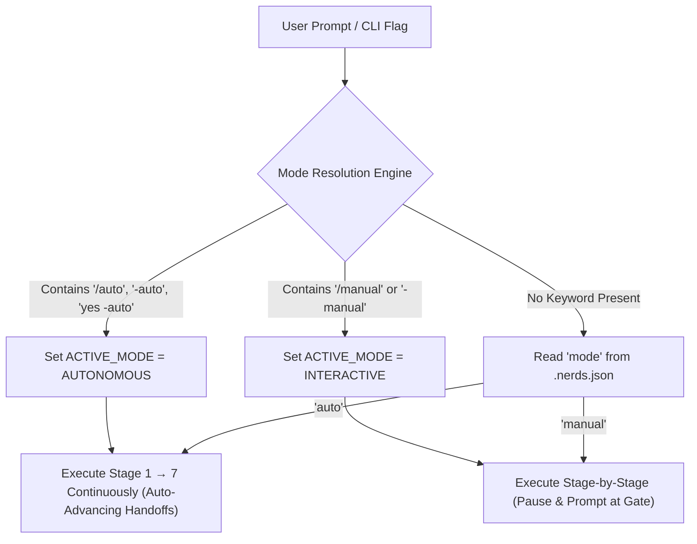

# Implementation Plan: Autonomous Mode Engine & Dynamic Mode Switching

Implement dual execution modes (`AUTONOMOUS` vs `INTERACTIVE`) across NERDS stack. Allow developers to set baseline mode via CLI flags (`-auto`, `-manual`), dynamically toggle modes in-session via prompt commands (`/auto`, `/manual`), and execute mid-stream handovers (`"yes -auto"`).

## User Review Required

> [!IMPORTANT]
> - CLI Installer Flags: Add `-auto` / `--auto` and `-manual` / `--manual` to `install.sh` and `bin/nerds-init.js`.
> - State Persistence: Store `"mode": "auto" | "manual"` in `.nerds.json`.
> - Directives & Protocols: Update [AGENTS.md](file:///home/shlok/Projects/nerds/AGENTS.md) and all 7 role instructions in `.nerds/instructions/` to evaluate prompt keywords (`/auto`, `/manual`, `"yes -auto"`) and execute auto-advancing handoffs without blocking when `mode` is `auto`.
> - Documentation: Update [README.md](file:///home/shlok/Projects/nerds/README.md) with Autonomous Mode options and scenario presets.

## System Architecture & Data Flow

### Modular File Isolation Spec
- Installer Logic: [bin/nerds-init.js](file:///home/shlok/Projects/nerds/bin/nerds-init.js)
- Project State File: [.nerds.json](file:///home/shlok/Projects/nerds/.nerds.json)
- System Directives: [AGENTS.md](file:///home/shlok/Projects/nerds/AGENTS.md)
- Role Instructions: [.nerds/instructions/01-product-ceo.md](file:///home/shlok/Projects/nerds/.nerds/instructions/01-product-ceo.md) through [07-git-nerd.md](file:///home/shlok/Projects/nerds/.nerds/instructions/07-git-nerd.md)
- Primary Documentation: [README.md](file:///home/shlok/Projects/nerds/README.md)
- Automated Test Suite: [testing/mode-engine-validator.js](file:///home/shlok/Projects/nerds/testing/mode-engine-validator.js)

### Data Flow Architecture

### Edge Case & Failure Mode Matrix

| Scenario / Edge Case | Cause / Trigger | Architect Resolution |
| :--- | :--- | :--- |
| **Conflicting Flags** | User passes `-auto` and `-manual` together | Last flag passed wins; fallback to `manual` if ambiguous |
| **Mid-Stream Handover** | User replies `"yes -auto"` during Stage 2 | Immediately switch `ACTIVE_MODE` to `AUTONOMOUS` and execute Stage 3 → 7 in same turn |
| **Missing .nerds.json** | Workspace initialized without config | Auto-create `.nerds.json` with `"mode": "manual"` default |
| **Malformed Keyword** | User types `/auto-mode` or `auto please` | Regex pattern matching for `auto` / `manual` triggers mode switch safely |

### Test Specifications
1. **CLI Flag Parser**: Assert `bin/nerds-init.js` correctly writes `"mode": "auto"` to `.nerds.json` when `-auto` flag is passed.
2. **Dynamic Directive Compliance**: Assert `AGENTS.md` contains dynamic mode resolution rules.
3. **Documentation Sync**: Verify `README.md` includes `-auto` flag options and top 5 scenario presets.

## Proposed Changes

### Installer & Logic Component

#### [MODIFY] [bin/nerds-init.js](file:///home/shlok/Projects/nerds/bin/nerds-init.js)
- Add `-auto` / `--auto` and `-manual` / `--manual` CLI options parsing.
- Write initial `mode` setting into `.nerds.json`.

#### [MODIFY] [.nerds.json](file:///home/shlok/Projects/nerds/.nerds.json)
- Add `"mode": "auto"` or `"mode": "manual"` setting.

### Core Directives Component

#### [MODIFY] [AGENTS.md](file:///home/shlok/Projects/nerds/AGENTS.md)
- Update `Inter-Nerd Stage Handoff & User Approval Protocol` to support `AUTONOMOUS` vs `INTERACTIVE` modes.
- Define dynamic mode resolution rules for `/auto`, `/manual`, and `"yes -auto"` mid-stream handovers.

#### [MODIFY] [.nerds/instructions/01-product-ceo.md](file:///home/shlok/Projects/nerds/.nerds/instructions/01-product-ceo.md)
#### [MODIFY] [.nerds/instructions/02-architect-em.md](file:///home/shlok/Projects/nerds/.nerds/instructions/02-architect-em.md)
#### [MODIFY] [.nerds/instructions/03-designing-incharge.md](file:///home/shlok/Projects/nerds/.nerds/instructions/03-designing-incharge.md)
#### [MODIFY] [.nerds/instructions/04-design-explorer-engineer.md](file:///home/shlok/Projects/nerds/.nerds/instructions/04-design-explorer-engineer.md)
#### [MODIFY] [.nerds/instructions/05-qa-lead.md](file:///home/shlok/Projects/nerds/.nerds/instructions/05-qa-lead.md)
#### [MODIFY] [.nerds/instructions/06-security-auditor.md](file:///home/shlok/Projects/nerds/.nerds/instructions/06-security-auditor.md)
#### [MODIFY] [.nerds/instructions/07-git-nerd.md](file:///home/shlok/Projects/nerds/.nerds/instructions/07-git-nerd.md)
- Update handoff protocol sections in instructions to handle autonomous auto-advancing vs interactive manual pause gates.

### Documentation Component

#### [MODIFY] [README.md](file:///home/shlok/Projects/nerds/README.md)
- Document Autonomous Mode installer flag (`-auto`), dynamic in-session commands (`/auto`, `/manual`), and mid-stream handovers (`"yes -auto"`).

## Verification Plan

### Automated Verification
- Run test validation script `testing/mode-engine-validator.js` to assert CLI flag parsing and `.nerds.json` configuration updates.
- Verify `README.md` and `AGENTS.md` contain mode engine definitions.
