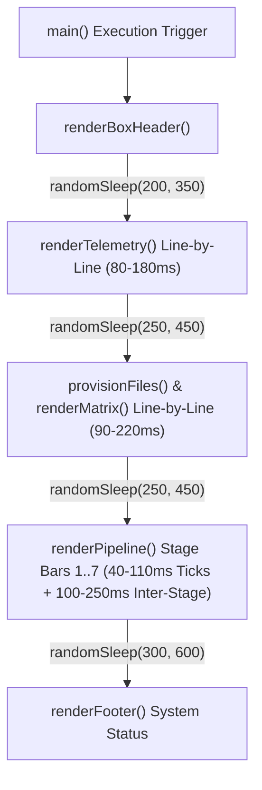

# Implementation Plan: Tactile Organic Animation Timing & Variable Section Delays

Tune section reveals and stage progress bar filling in `bin/nerds-init.js` to be slightly slower with higher variance (`randomSleep(min, max)`), creating an unhurried, authentic cyber terminal experience.

## User Review Required

> [!IMPORTANT]
> - Dynamic Random Sleep: Replace fixed sleep with `randomSleep(minMs, maxMs)`.
> - Section Delays: Add 200ms-450ms randomized delays between section reveals and line items.
> - Progress Bar Speed: Expand bar fill to 4-6 randomized thresholds per stage with 40ms-110ms variable tick delays and 100ms-250ms inter-stage pauses.

## System Architecture & Data Flow

### Modular File Isolation Spec
- Primary Installer Target: [bin/nerds-init.js](file:///home/shlok/Projects/nerds/bin/nerds-init.js)
- Design Specifications: [product_design_master.md](file:///home/shlok/Projects/nerds/product_design_master.md)
- QA Test Suite: [testing/cli-ui-validator.js](file:///home/shlok/Projects/nerds/testing/cli-ui-validator.js)

### Data Flow Architecture

### Edge Case & Failure Mode Matrix

| Scenario / Edge Case | Cause / Trigger | Architect Resolution |
| :--- | :--- | :--- |
| **Non-TTY / CI Environment** | Running in CI runner | `randomSleep` checks `isInteractive` and resolves instantly (`0ms`) |
| **Range Validation** | `minMs > maxMs` argument error | Clamp `maxMs = Math.max(minMs, maxMs)` inside `randomSleep` |

### Test Specifications
1. **randomSleep Helper Assertion**: Verify `randomSleep(min, max)` is exported or defined in `bin/nerds-init.js`.
2. **Variable Delays Assertion**: Verify `animateStageLine` uses variable step thresholds and random sleep ticks.

## Proposed Changes

### Installer CLI Component

#### [MODIFY] [bin/nerds-init.js](file:///home/shlok/Projects/nerds/bin/nerds-init.js)
- Add `randomSleep(min, max)` helper.
- Update `renderTelemetry`, `animateStageLine`, `renderPipeline`, `renderMatrix`, and `main()` to use randomized, tactile delay ranges.

### Verification Component

#### [MODIFY] [testing/cli-ui-validator.js](file:///home/shlok/Projects/nerds/testing/cli-ui-validator.js)
- Assert `randomSleep` helper is present in validator.

## Verification Plan

### Automated Verification
- Run `node ./testing/cli-ui-validator.js` to assert code syntax.
- Run `node ./bin/nerds-init.js` to visually experience the tactile organic animation.
