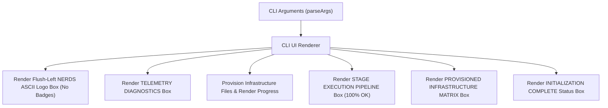

# Implementation Plan: Redesign CLI Installer UI (cliNEW.txt Specification)

Transform the `bin/nerds-init.js` terminal UI output to match the cyber box-drawing interface defined in `cliNEW.txt`. Remove side margins (0 left margin alignment) and omit the 4 right-side header badges as instructed by user.

## User Review Required

> [!IMPORTANT]
> - Target UI: `cliNEW.txt` styled box art terminal interface.
> - Removed Badges: Omit `[v2.4.0-CYBER]`, `[NET: LOCAL/CONNECTED]`, `[SYS: AUTONOMOUS_ENGINE]`, and `[CORE: 7-ROLE_DIRECTOR]`.
> - Alignment: Flush left column alignment (zero left/right margin padding).

## System Architecture & Data Flow

### Modular File Isolation Spec
- Primary File Target: [bin/nerds-init.js](file:///home/shlok/Projects/nerds/bin/nerds-init.js)
- Reference Template: [cliNEW.txt](file:///home/shlok/Projects/nerds/cliNEW.txt)
- Design Specifications: [product_design_master.md](file:///home/shlok/Projects/nerds/product_design_master.md)
- Automated QA Test Suite: [testing/cli-ui-validator.js](file:///home/shlok/Projects/nerds/testing/cli-ui-validator.js)

### Data Flow Architecture

### Edge Case & Failure Mode Matrix

| Scenario / Edge Case | Cause / Trigger | Architect Resolution |
| :--- | :--- | :--- |
| **No-Color Terminal Environment** | Terminal sets `NO_COLOR=1` or `TERM=dumb` | Disable ANSI escape codes while keeping Unicode box-drawing characters intact |
| **Narrow Terminal Viewport** | Terminal width < 80 columns | Align flush-left without left margin padding so text does not line-wrap awkwardly |
| **Provision Failure** | A file download or copy fails | Render status badge `[FAILED]` in amber/red without breaking box layout alignment |

### Test Specifications
1. **ASCII Logo Verification**: Assert double-line box `╔═╗` containing `NERDS` block font without badge text.
2. **Left Margin Verification**: Assert 0 leading spaces before box border characters `╔`, `┌`, `║`, `│`, `╚`, `└`.
3. **Excluded Badges Check**: Assert text does NOT contain `[v2.4.0-CYBER]`, `[NET: LOCAL/CONNECTED]`, `[SYS: AUTONOMOUS_ENGINE]`, or `[CORE: 7-ROLE_DIRECTOR]`.
4. **Sections Verification**: Assert presence of `TELEMETRY DIAGNOSTICS`, `STAGE EXECUTION PIPELINE`, `PROVISIONED INFRASTRUCTURE MATRIX`, and `INITIALIZATION COMPLETE`.

## Proposed Changes

### Installer CLI Component

#### [MODIFY] [bin/nerds-init.js](file:///home/shlok/Projects/nerds/bin/nerds-init.js)
- Replace legacy text headers with double-line unicode ASCII logo box (`╔═╗║╚═╝`).
- Render Telemetry Diagnostics section box (`┌── TELEMETRY DIAGNOSTICS ──┐`).
- Render Stage Execution Pipeline 7-stage progress list (`[1/7]` through `[7/7]`).
- Render Provisioned Infrastructure Matrix box (`✔ .gemini/instructions.md`, `AGENTS.md`, `.nerds/...`, `.env.local`).
- Render Initialization Complete double-box status message (`SYSTEM STATUS: INITIALIZATION COMPLETE`).

### Verification Component

#### [NEW] [testing/cli-ui-validator.js](file:///home/shlok/Projects/nerds/testing/cli-ui-validator.js)
- Automated verification script to assert string layout, box border structure, missing badge enforcement, and ANSI formatting.

## Verification Plan

### Automated Verification
- Run `node ./testing/cli-ui-validator.js` to assert terminal output layout matches design rules.
