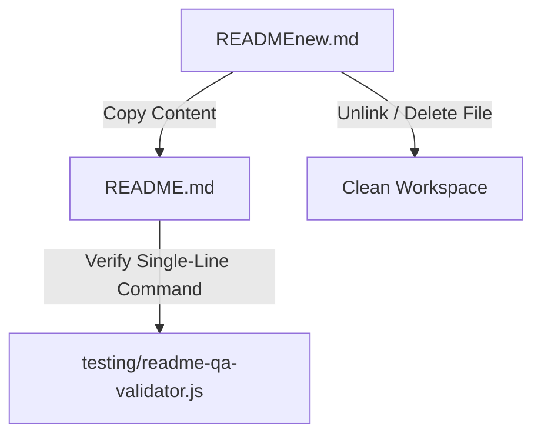

# Implementation Plan: Promote READMEnew.md to Primary README.md

Promote the newly created, verified `READMEnew.md` to primary `README.md` and clean up `READMEnew.md`.

## User Review Required

> [!IMPORTANT]
> - Target: Overwrite [README.md](file:///home/shlok/Projects/nerds/README.md) with verified single-line installation content and top 5 scenario presets.
> - Cleanup: Remove temporary file `READMEnew.md`.

## System Architecture & Data Flow

### Modular File Isolation Spec
- Primary File Target: [README.md](file:///home/shlok/Projects/nerds/README.md)
- File Cleanup Target: [READMEnew.md](file:///home/shlok/Projects/nerds/READMEnew.md)
- Test Harness: [testing/readme-qa-validator.js](file:///home/shlok/Projects/nerds/testing/readme-qa-validator.js)

### Data Flow Architecture

### Edge Case & Failure Mode Matrix

| Scenario / Edge Case | Cause / Trigger | Architect Resolution |
| :--- | :--- | :--- |
| **Validator Points to Old File** | `testing/readme-qa-validator.js` targets `READMEnew.md` | Update validator to target `README.md` |
| **Missing Content During Copy** | Truncated copy | Perform full byte-for-byte overwrite before file deletion |

### Test Specifications
1. Verify `README.md` exists and contains exact string `curl -fsSL https://raw.githubusercontent.com/shlok377/nerds/main/install.sh | bash`.
2. Execute updated `testing/readme-qa-validator.js` against `README.md`.

## Proposed Changes

### Documentation Component

#### [MODIFY] [README.md](file:///home/shlok/Projects/nerds/README.md)
- Overwrite with new single-line installer (`curl -fsSL https://raw.githubusercontent.com/shlok377/nerds/main/install.sh | bash`), top 5 preset scenarios, 7-stage quality pipeline diagram, CLI flags table, and security rules.

#### [DELETE] [READMEnew.md](file:///home/shlok/Projects/nerds/READMEnew.md)
- Remove temporary document file after promoting to `README.md`.

#### [MODIFY] [testing/readme-qa-validator.js](file:///home/shlok/Projects/nerds/testing/readme-qa-validator.js)
- Update target file path from `READMEnew.md` to `README.md`.

## Verification Plan

### Automated Verification
- Run `node ./testing/readme-qa-validator.js` to assert all 5 quality checks pass on `README.md`.
